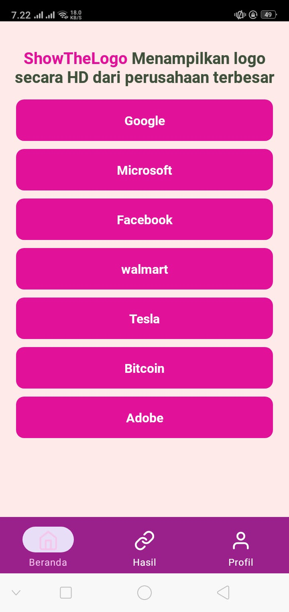
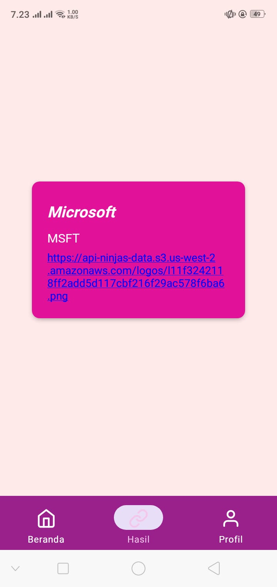
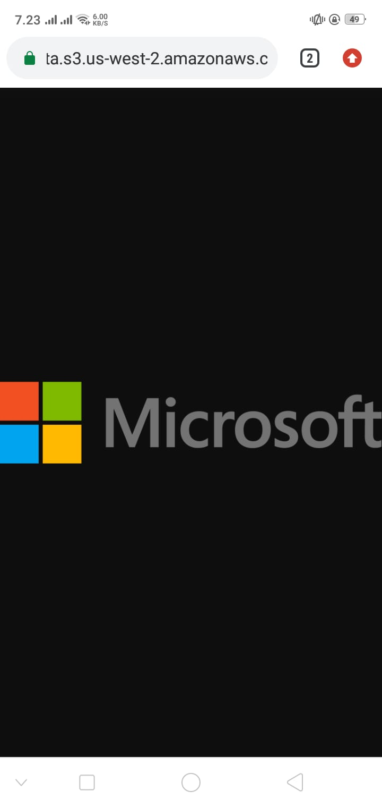

# ShowTheLogoLinks
Fadhilah Fauza Hamda - 120140153

## Download Link
Download <a href="https://expo.dev/artifacts/eas/tkgpktzML219ye3BN4vGBp.apk">ShowTheLogoLinks</a>

## Depedencies
- React Native
- Expo
- React Native Vector Icons
- React Navigation
- Api Ninjas

## Struktur Repo
## Sturktur Repository
```
/                   # Folder Root
├─ assets/          # Semua data gambar
│  └─ favicon.png
│  └─ icon.png
│  └─ adaptive-icon.png
│  └─ splash.png
├─ src/
├─ └─ components/
│     └─ tabnav.js  # Tab Navbar
│  └─ db/
│     └─ index.js   # data name
│  └─ pages/
│     └─ beranda.js # halaman utama
│     └─ hasil.js   # halaman hasil
│     └─ profile.js # halaman profile
|
├─ App.js           # file utama untuk merender semua file 
├─ .gitignore
├─ README.md
├─ app.json
├─ babel.config.json
├─ eas.json
├─ package-lock.json
├─ package.json
/                   # Folder Root
```

## Cara Menjalankan
- Clone Repository ini
- Masuk Kedalam directory utama dan jalankan
```
npm install
```
atau
```
npm install -f
```
- tunggu hingga proses selesai
- jika ingin di jalankan dengan android maka gunakan syntax berikut 
```
npm run android
``` 

## Screenshoot
### Halaman Beranda


### Halaman Detail


### Jika Link di Tekan


### Halaman Profile

